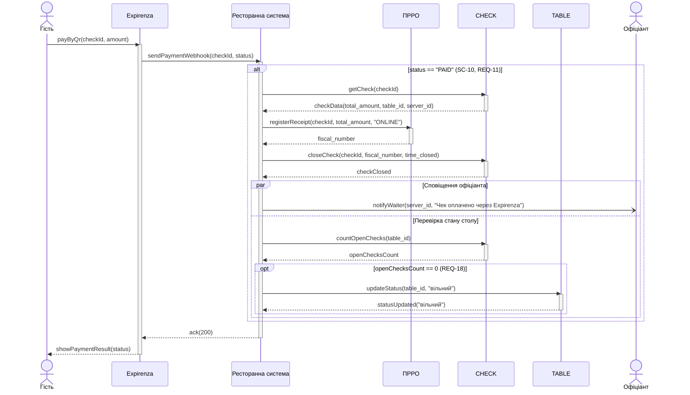
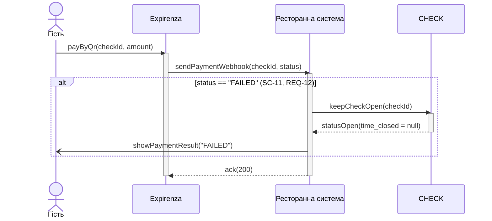
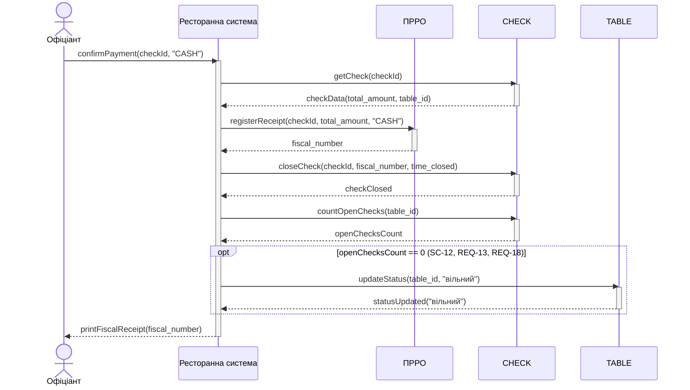
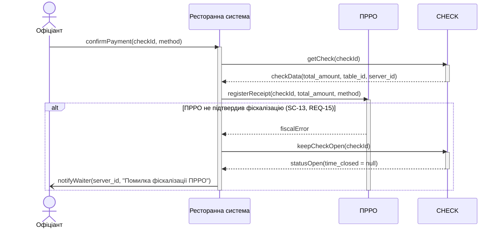
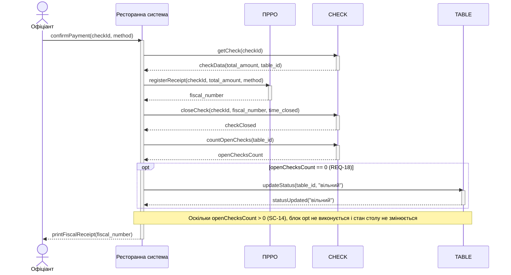
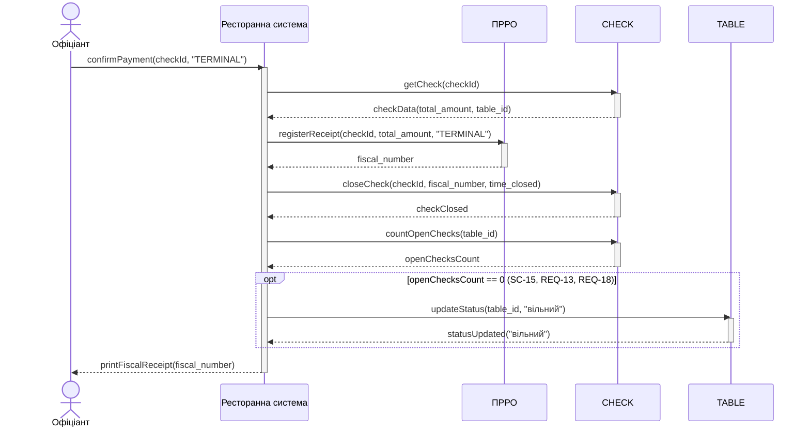

## Діаграма Сценарій 1 (SC-10)

```mermaid
sequenceDiagram
    actor Guest as Гість
    participant Expirenza as Expirenza
    participant System as Ресторанна система
    participant PRRO as ПРРО
    participant CHECK as CHECK
    participant TABLE as TABLE
    actor Waiter as Офіціант

    Guest ->> Expirenza: payByQr(checkId, amount)
    activate Expirenza
    Expirenza ->> System: sendPaymentWebhook(checkId, status)
    activate System

    alt status == "PAID" (SC-10, REQ-11)
        System ->> CHECK: getCheck(checkId)
        activate CHECK
        CHECK -->> System: checkData(total_amount, table_id, server_id)
        deactivate CHECK

        System ->> PRRO: registerReceipt(checkId, total_amount, "ONLINE")
        activate PRRO
        PRRO -->> System: fiscal_number
        deactivate PRRO

        System ->> CHECK: closeCheck(checkId, fiscal_number, time_closed)
        activate CHECK
        CHECK -->> System: checkClosed
        deactivate CHECK

        par Сповіщення офіціанта
            System -) Waiter: notifyWaiter(server_id, "Чек оплачено через Expirenza")
        and Перевірка стану столу
            System ->> CHECK: countOpenChecks(table_id)
            activate CHECK
            CHECK -->> System: openChecksCount
            deactivate CHECK

            opt openChecksCount == 0 (REQ-18)
                System ->> TABLE: updateStatus(table_id, "вільний")
                activate TABLE
                TABLE -->> System: statusUpdated("вільний")
                deactivate TABLE
            end
        end
    end

    System -->> Expirenza: ack(200)
    deactivate System
    Expirenza -->> Guest: showPaymentResult(status)
    deactivate Expirenza
```

## Діаграма Сценарій 2 (SC-11)

```mermaid
sequenceDiagram
    actor Guest as Гість
    participant Expirenza as Expirenza
    participant System as Ресторанна система
    participant CHECK as CHECK

    Guest ->> Expirenza: payByQr(checkId, amount)
    activate Expirenza
    Expirenza ->> System: sendPaymentWebhook(checkId, status)
    activate System

    alt status == "FAILED" (SC-11, REQ-12)
        System ->> CHECK: keepCheckOpen(checkId)
        activate CHECK
        CHECK -->> System: statusOpen(time_closed = null)
        deactivate CHECK
        System -) Guest: showPaymentResult("FAILED")
    end

    System -->> Expirenza: ack(200)
    deactivate System
    deactivate Expirenza
```

## Діаграма Сценарій 3 (SC-12)

```mermaid
sequenceDiagram
    actor Waiter as Офіціант
    participant System as Ресторанна система
    participant PRRO as ПРРО
    participant CHECK as CHECK
    participant TABLE as TABLE

    Waiter ->> System: confirmPayment(checkId, "CASH")
    activate System

    System ->> CHECK: getCheck(checkId)
    activate CHECK
    CHECK -->> System: checkData(total_amount, table_id)
    deactivate CHECK

    System ->> PRRO: registerReceipt(checkId, total_amount, "CASH")
    activate PRRO
    PRRO -->> System: fiscal_number
    deactivate PRRO

    System ->> CHECK: closeCheck(checkId, fiscal_number, time_closed)
    activate CHECK
    CHECK -->> System: checkClosed
    deactivate CHECK

    System ->> CHECK: countOpenChecks(table_id)
    activate CHECK
    CHECK -->> System: openChecksCount
    deactivate CHECK

    opt openChecksCount == 0 (SC-12, REQ-13, REQ-18)
        System ->> TABLE: updateStatus(table_id, "вільний")
        activate TABLE
        TABLE -->> System: statusUpdated("вільний")
        deactivate TABLE
    end

    System -->> Waiter: printFiscalReceipt(fiscal_number)
    deactivate System
```

## Діаграма Сценарій 4 (SC-13)

```mermaid
sequenceDiagram
    actor Waiter as Офіціант
    participant System as Ресторанна система
    participant PRRO as ПРРО
    participant CHECK as CHECK

    Waiter ->> System: confirmPayment(checkId, method)
    activate System

    System ->> CHECK: getCheck(checkId)
    activate CHECK
    CHECK -->> System: checkData(total_amount, table_id, server_id)
    deactivate CHECK

    System ->> PRRO: registerReceipt(checkId, total_amount, method)
    activate PRRO

    alt ПРРО не підтвердив фіскалізацію (SC-13, REQ-15)
        PRRO -->> System: fiscalError
        System ->> CHECK: keepCheckOpen(checkId)
        activate CHECK
        CHECK -->> System: statusOpen(time_closed = null)
        deactivate CHECK
        System -) Waiter: notifyWaiter(server_id, "Помилка фіскалізації ПРРО")
    end

    deactivate PRRO
    deactivate System
```

## Діаграма Сценарій 5 (SC-14)

```mermaid
sequenceDiagram
    actor Waiter as Офіціант
    participant System as Ресторанна система
    participant PRRO as ПРРО
    participant CHECK as CHECK
    participant TABLE as TABLE

    Waiter ->> System: confirmPayment(checkId, method)
    activate System

    System ->> CHECK: getCheck(checkId)
    activate CHECK
    CHECK -->> System: checkData(total_amount, table_id)
    deactivate CHECK

    System ->> PRRO: registerReceipt(checkId, total_amount, method)
    activate PRRO
    PRRO -->> System: fiscal_number
    deactivate PRRO

    System ->> CHECK: closeCheck(checkId, fiscal_number, time_closed)
    activate CHECK
    CHECK -->> System: checkClosed
    deactivate CHECK

    System ->> CHECK: countOpenChecks(table_id)
    activate CHECK
    CHECK -->> System: openChecksCount
    deactivate CHECK

    opt openChecksCount == 0 (REQ-18)
        System ->> TABLE: updateStatus(table_id, "вільний")
        activate TABLE
        TABLE -->> System: statusUpdated("вільний")
        deactivate TABLE
    end

    Note over System,TABLE: Оскільки openChecksCount > 0 (SC-14), блок opt не виконується і стан столу не змінюється
    System -->> Waiter: printFiscalReceipt(fiscal_number)
    deactivate System
```

## Діаграма Сценарій 6 (SC-15)

```mermaid
sequenceDiagram
    actor Waiter as Офіціант
    participant System as Ресторанна система
    participant PRRO as ПРРО
    participant CHECK as CHECK
    participant TABLE as TABLE

    Waiter ->> System: confirmPayment(checkId, "TERMINAL")
    activate System

    System ->> CHECK: getCheck(checkId)
    activate CHECK
    CHECK -->> System: checkData(total_amount, table_id)
    deactivate CHECK

    System ->> PRRO: registerReceipt(checkId, total_amount, "TERMINAL")
    activate PRRO
    PRRO -->> System: fiscal_number
    deactivate PRRO

    System ->> CHECK: closeCheck(checkId, fiscal_number, time_closed)
    activate CHECK
    CHECK -->> System: checkClosed
    deactivate CHECK

    System ->> CHECK: countOpenChecks(table_id)
    activate CHECK
    CHECK -->> System: openChecksCount
    deactivate CHECK

    opt openChecksCount == 0 (SC-15, REQ-13, REQ-18)
        System ->> TABLE: updateStatus(table_id, "вільний")
        activate TABLE
        TABLE -->> System: statusUpdated("вільний")
        deactivate TABLE
    end

    System -->> Waiter: printFiscalReceipt(fiscal_number)
    deactivate System
```
