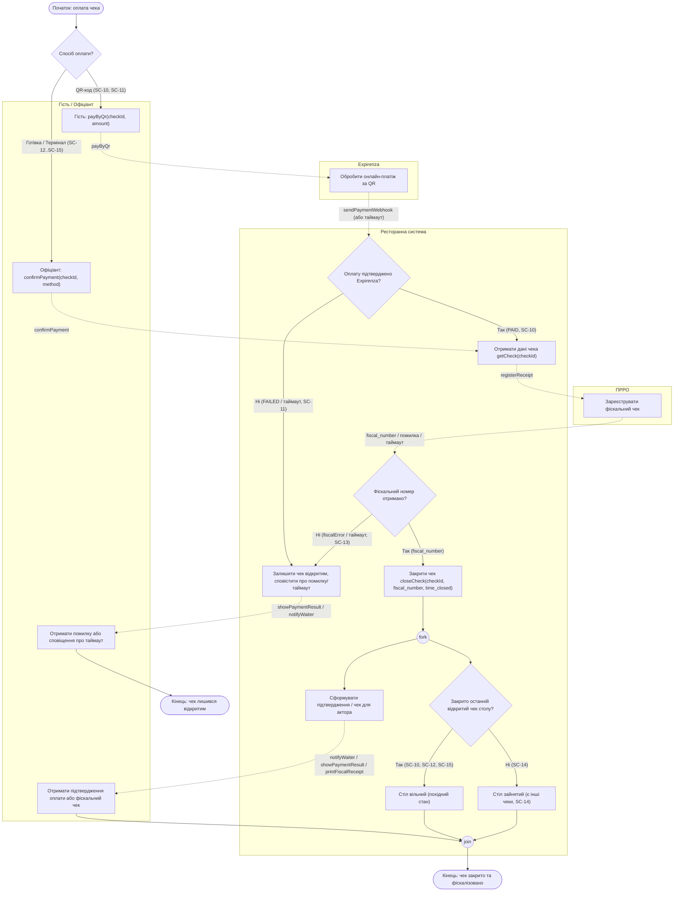

# Activity-діаграма бізнес-процесу оплати чека (`UC-10`)

```mermaid
flowchart TD
    Start(["Початок: оплата чека"]) --> Channel{"Спосіб оплати?"}

    subgraph Actors["Гість / Офіціант"]
        PayQR["Гість: payByQr(checkId, amount)"]
        ConfirmPay["Офіціант: confirmPayment(checkId, method)"]
        NotifyErr["Отримати помилку або сповіщення про таймаут"]
        ActorDone["Отримати підтвердження оплати або фіскальний чек"]
    end

    subgraph Expirenza["Expirenza"]
        ExpProc["Обробити онлайн-платіж за QR"]
    end

    subgraph System["Ресторанна система"]
        CheckExp{"Оплату підтверджено Expirenza?"}
        GetCheck["Отримати дані чека getCheck(checkId)"]
        CheckPRRO{"Фіскальний номер отримано?"}
        HandleErr["Залишити чек відкритим, сповістити про помилку/таймаут"]
        CloseCheck["Закрити чек closeCheck(checkId, fiscal_number, time_closed)"]
        Fork(("fork"))
        NotifyOk["Сформувати підтвердження / чек для актора"]
        CheckTable{"Закрито останній відкритий чек столу?"}
        FreeTable["Стіл вільний (похідний стан)"]
        BusyTable["Стіл зайнятий (є інші чеки, SC-14)"]
        Join(("join"))
    end

    subgraph PRRO["ПРРО"]
        PRROProc["Зареєструвати фіскальний чек"]
    end

    Channel -->|"QR-код (SC-10, SC-11)"| PayQR
    Channel -->|"Готівка / Термінал (SC-12..SC-15)"| ConfirmPay

    PayQR -.->|"payByQr"| ExpProc
    ExpProc -.->|"sendPaymentWebhook (або таймаут)"| CheckExp

    CheckExp -->|"Ні (FAILED / таймаут, SC-11)"| HandleErr
    CheckExp -->|"Так (PAID, SC-10)"| GetCheck
    ConfirmPay -.->|"confirmPayment"| GetCheck

    GetCheck -.->|"registerReceipt"| PRROProc
    PRROProc -.->|"fiscal_number / помилка / таймаут"| CheckPRRO

    CheckPRRO -->|"Ні (fiscalError / таймаут, SC-13)"| HandleErr
    HandleErr -.->|"showPaymentResult / notifyWaiter"| NotifyErr
    NotifyErr --> EndFail(["Кінець: чек лишився відкритим"])

    CheckPRRO -->|"Так (fiscal_number)"| CloseCheck
    CloseCheck --> Fork

    Fork --> NotifyOk
    Fork --> CheckTable

    NotifyOk -.->|"notifyWaiter / showPaymentResult / printFiscalReceipt"| ActorDone
    ActorDone --> Join

    CheckTable -->|"Так (SC-10, SC-12, SC-15)"| FreeTable
    CheckTable -->|"Ні (SC-14)"| BusyTable
    FreeTable --> Join
    BusyTable --> Join

    Join --> EndOk(["Кінець: чек закрито та фіскалізовано"])
```
